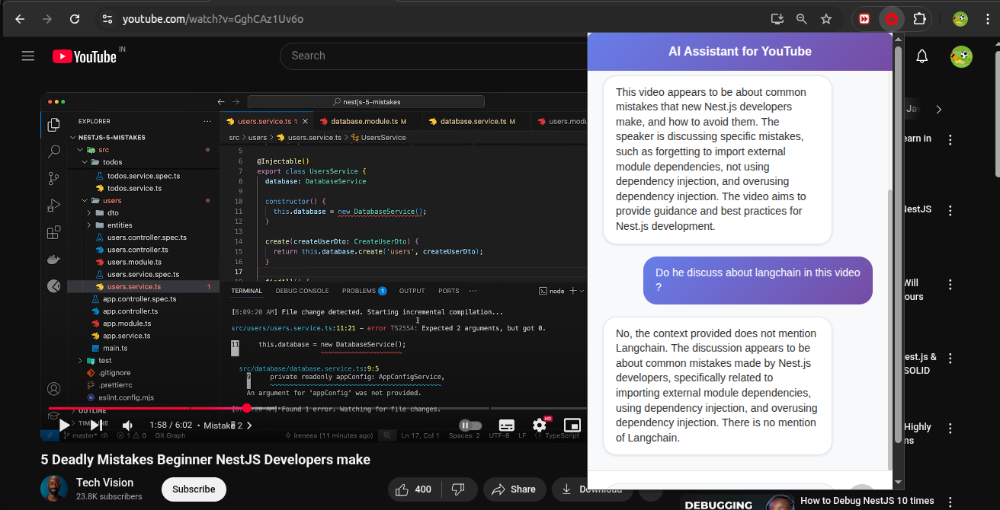

# 🎥 AI Assistant for YouTube Videos – Chrome Extension

This is a **Google Chrome Extension** designed to help users interact with YouTube videos using AI. It enables users to **ask questions** about a video's content and receive intelligent, context-aware answers — ideal for navigating long-form educational videos.

---

## 🧩 Why This Matters

YouTube is a powerful learning platform, but lengthy videos can make it difficult to locate specific topics. This extension solves that problem by allowing users to **query the video content directly**, using AI to pinpoint relevant answers.

---

## ⚙️ How It Works

### 🧠 Backend (Node.js + LangChain)

1. **Video URL Detection**  
   Receives YouTube video URL via API.
2. **Audio Extraction**  
   Processes the video to extract audio data.
3. **Transcription**  
   Converts audio to text using [`transcribe2texts`](https://www.npmjs.com/package/transcribe2texts).
4. **LangChain AI Agent**  
   Initializes a custom LangChain agent with tools:
   - `getText`: Retrieves transcript.
   - `getAnswer`: Answers questions based on the transcript.
   - `getVideo`: Downloads and prepares media content.
5. **API Endpoints**  
   - `POST /initialize`: Initializes the agent with a video.
   - `POST /ask`: Accepts user questions and returns AI-generated answers.

### 🖼️ Frontend (React.js Chrome Extension)

- Detects YouTube video pages (`youtube.com/watch`)
- Calls `initialize` API when a new video is loaded
- Shows chat interface once AI agent is ready
- Sends user questions to the `ask` API
- Supports follow-up questions and persistent sessions
- Clean UI with scrollable, stateful chat interface

---

## 🧠 Key Features

- ✅ **Smart Video Detection**  
  Detects YouTube video changes using multiple strategies.

- 💾 **Session Persistence**  
  Remembers chat history even after closing the extension popup.

- 🌐 **Cross-tab Awareness**  
  Background scripts manage state across multiple tabs.

- 🧹 **Memory Management**  
  Automatically cleans up data when navigating away from YouTube.

---

## 🛠️ Tech Stack

**Backend**
- Node.js
- JavaScript
- LangChain (AI Agent Framework)
- [`transcribe2texts`](https://www.npmjs.com/package/transcribe2texts)

**Frontend**
- React.js (Popup UI)
- JavaScript (Content + Background Scripts)
- Chrome Manifest V3

---

## 📸 Application Screenshot

